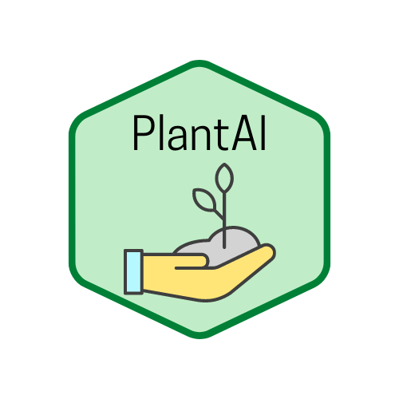
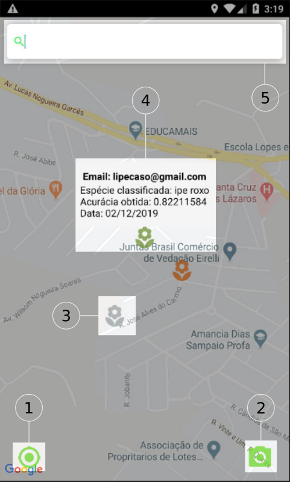
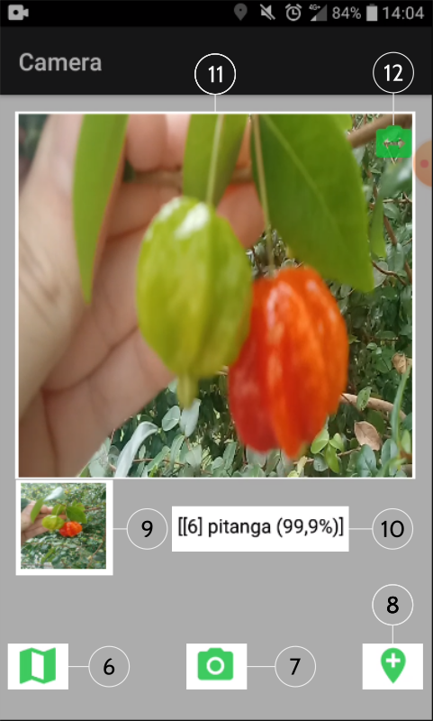

# PlantAI 


# Visão Geral

A identificação de espécies de plantas em extinção é uma tarefa importante, porém complexa. O projeto Lista Vermelha existe para catalogar a lista de plantas classificadas em diferentes níveis de ameaça e conta com uma equipe composta por profissionais responsáveis em avaliar o risco de extinção de espécies da flora brasileira. Ainda assim, devido à diversidade e à similaridade contida nos biomas brasileiros, a identificação correta de plantas não é uma tarefa trivial. Os avanços tecnológicos vieram contribuir neste sentido, tornando possível a obtenção de um grande volume de dados de diferentes fontes, o que motivou este trabalho a apresentar um aplicativo protótipo instruído para classificar plantas com diferentes níveis de ameaça da Mata Atlântica, e mapeá-las de forma colaborativa. Uma Rede Neural Convolucional foi treinada com amostras aumentadas de diferentes espécies de plantas, utilizando a técnica de transferência de aprendizado em diferentes blocos de convolução do modelo MobileNet, e é utilizada para a classificação online de imagens coletadas com o aplicativo. Os experimentos foram realizados no município de Jacareí-SP. Para as duas espécies avaliadas, Araucária e Pitanga, obteve-se a acurácia superior a 90%.


<p align="center">
 &nbsp;&nbsp;&nbsp;&nbsp;

 
 
</p>


O aplicativo PlantAI utiliza duas frentes tecnológicas para o seu funcionamento: o banco de dados Firebase RealTime para o armazenamento dos metadados de localização e classificação, e o Google Maps SDK para visualização das classificações em um mapa. A Figura acima (esquerda) apresenta a tela do mapa colaborativo, a legenda numérica apresenta as seguintes funcionalidades: o ícone de localização (**1**) possui a função de localizar a atual posição do usuário; o ícone da câmera (**2**) inicia a tela de classificação; os ícones de flores (**3**) recebem diferentes cores de acordo com a atual situação da planta classificada, em que plantas *em perigo* recebem o marcador laranja, plantas *quase ameaçadas* recebem o marcador verde claro e as plantas que não se encontram em nenhuma das situações anteriores recebem a cor cinza. A paleta de cores utilizada baseia-se no Projeto da Lista Vermelha. Por fim, a barra de busca (**5**), facilita a busca do usuário por localizações de cidades, bairros e ruas. No marcador verde (**4**), observam-se algumas informações relevantes, como o e-mail do usuário que identificou a planta, a espécie identificada, a acurácia obtida e a data de classificação. A tela de classificação (direita), assim como a tela do mapa colaborativo, é composta por números para facilitar o entendimento de cada funcionalidade. Os ícones da horizontal inferior (**6**,**7**,**8**), representam os ícones de mapa, câmera e adição, respectivamente. O mapa (**6**) possui a função de voltar para a tela do mapa colaborativo, a câmera (**7**) tem por objetivo  capturar imagens, e consequentemente, classificá-las (**10**). Logo após a classificação, é possível visualizar a imagem capturada (**9**). Por fim, o usuário tem a opção de adicionar a classificação feita no mapa colaborativo (**8**).


Para mais informações, veja o artigo: [PlantAI: Aplicativo de classificação e localização de plantas em risco de extinção na Mata Atlântica](https://doi.org/10.5753/wcama.2020.11014)

# Guia de instalação

1. Instale o java e os complementos listados abaixo (versões recomendadas):
    - openjdk-13-jre-headless
    - openjdk-13-jdk
    - sdk version 30
    - build tools 30.0.3	
	
2. Bibliotecas necessárias para Linux 64 bits

```bash
    sudo apt-get install libc6:i386 libncurses5:i386 libstdc++6:i386 lib32z1 libbz2-1.0:i386
```
 
3. Crie uma conta Google e abra o [Google Console API](https://console.developers.google.com):
    - 3.1 Crie um novo projeto;
	- 3.2 Ative a biblioteca [Maps SDK for Android](https://developers.google.com/maps/documentation/android-sdk)
	    - 3.2.1 Gere a chave da API para usar no aplicativo
	- 3.3 Insira a chave gerado no arquivo [AndroidManifest](colocar link da linha)

> Com isso, o nosso mapa está pronto para ser inicializado. Agora vamos criar o banco de dados e a autenticação via Firebase.

4. Crie um projeto [Firebase](https://firebase.google.com):
	- 4.1 Vincule o projeto Firebase com o projeto criado no [Google Console](https://console.developers.google.com)
	- 4.2 Com isso, vá nas configurações do projeto e vincule o projeto Firebase com o aplicativo PlantAI:
	    - 4.2.1 Inclua no campo **Nome do Pacote**, o seguinte caminho: **com.br.plantai**
	    - 4.2.2 Gere o certificado SHA1 para registrar no campo 'Certificado de assinatura':
	        - Em Linux, use: 
	        ```keytool -list -v -alias androiddebugkey -keystore /home/$USER_NAME$/.android/debug.keystore```
	
5. Crie um banco de dados [Firebase Realtime Database](https://firebase.google.com/docs/database) para armazenar os metadados de localização:
	5.1 Localização: **us-central1**
	5.2 Adicione nas regras do banco de dados: `auth != null` para os campos **.read** e **.write**

6. Para criar o login, ative a autenticação via [Firebase Authentication](https://firebase.google.com/docs/auth):
    6.1 Selecione as opções de login via email/senha e Google
    	6.1.1 Para a opção de email Google é necessário adicionar o email do projeto ou pessoal
        
7. Por fim, vá nas configurações do projeto e baixe o arquivo `google-services.json`:
    7.1 Esse arquivo já está presente na estrutura de diretório ([aqui]()), apenas adicione as informações
    contidas no mesmo.
    
# Agradecimentos
Aos professores Giuliano Bertoti e Rafael Santos, e aos colegas de laboratório Amita Muralikrishna, Felipe Carlos, Adriano Almeida e Helvecio L. Neto.

# Contribuições
Sinta-se à vontade para contribuir com o aplicativo. Em caso de dúvidas, adicione [Issues](colocar link) e/ou entre em contate por email: lipecaso@gmail.com
